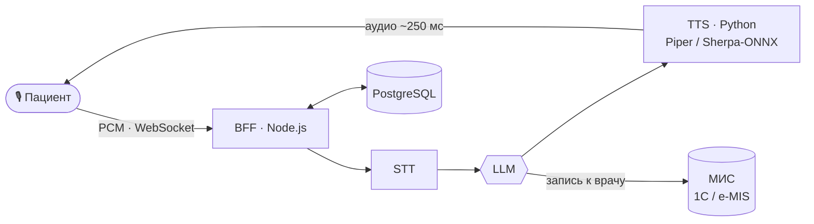

<p align="center">
  <a href="https://git.io/typing-svg">
    
  </a>
</p>

<p align="center">
  <a href="https://t.me/belyix"></a>
  <a href="mailto:aldiyarbeysenbek@gmail.com"></a>
  
  
</p>

---

## 🏥 Айжан — ИИ-регистратор для поликлиник РК

Голосовой ассистент на киоске в холле поликлиники. Пациент говорит на **казахском или русском**, Айжан понимает запрос
и **сама записывает его к врачу в медицинскую информационную систему**.

> 🟢 **В продакшене** в государственных поликлиниках: Карасайская ЦРБ, Баканас



| | |
|---|---|
| ⚡ **Real-time голос** | STT → LLM → TTS по WebSocket, KZ / RU |
| 🔊 **Self-hosted TTS** | FastAPI + Piper / Sherpa-ONNX, задержка ~200–300 мс |
| 🔌 **Интеграция с МИС** | Playwright-RPA → реверс HTTP-протокола 1С: логин, слоты и бронь без браузера |
| 🏢 **Мультиорганизационность** | несколько больниц, роли, синхронизация расписаний врачей |
| 📹 **Телемедицина** | видеоконсультации с дежурным врачом, SOS-вызов, Telegram |
| 🔐 **Безопасность** | RLS, закрытие IDOR, аудиты, данные хранятся в Казахстане |
| 🖥️ **Киоски** | Electron-приложение, деплой в Docker / Coolify |

<sub>🔒 Код проекта коммерческий и закрыт. Демо и архитектуру покажу на созвоне.</sub>

---

## 🛠️ Стек

<p align="center">
  <br/><br/>
  
</p>

<p align="center">
  
  
  
  
  
</p>

---

## 💡 Чем могу быть полезен

```yaml
- Довести MVP от идеи до продакшена в реальной клинике, а не только до демо
- Разобраться в МИС и процессах регистратуры и сделать интеграцию там, где нет API
- Собрать голосового или чат-ассистента на LLM под казахский и русский
- Закрыть безопасность и требования к медданным до того, как о них спросят
```

---

## 📈 Активность

<p align="center">
  <br/>
  
</p>

<p align="center">
  <picture>
    <source media="(prefers-color-scheme: dark)" srcset="https://raw.githubusercontent.com/alherc/alherc/output/github-snake-dark.svg" />
    <source media="(prefers-color-scheme: light)" srcset="https://raw.githubusercontent.com/alherc/alherc/output/github-snake.svg" />
    
  </picture>
</p>


